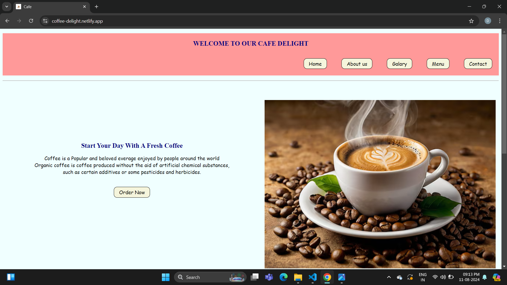
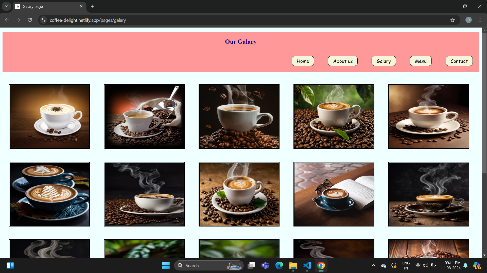
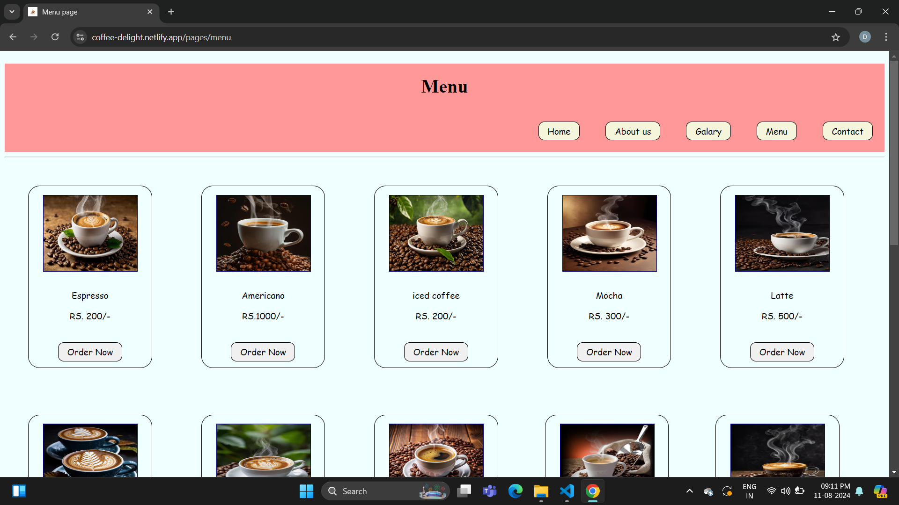
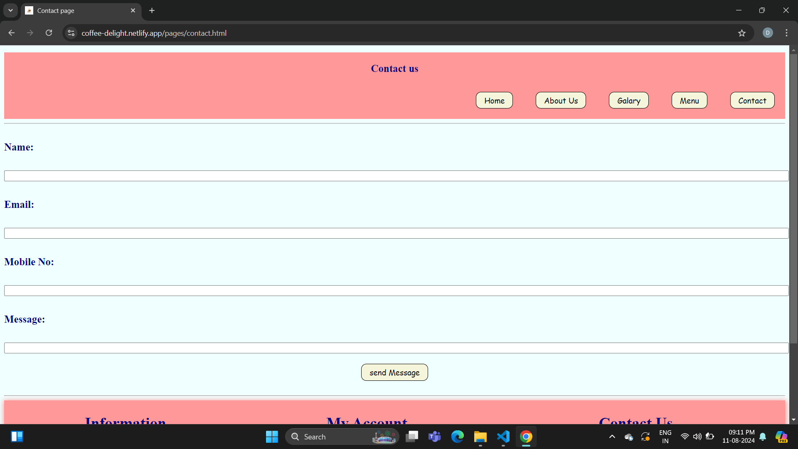

# Cafe Delight

Welcome to our   cafe delight*!*

This is open-source *dummy project i.e (just for practice)*
information about coffee menus like
home ,contact and many more etc.

Website URL : [visit our website](https://coffee-delight.netlify.app/)

We have various pages in this websites are as follows :

- *Home*
-*About Us*
-*Galary*
- *Contact*
- *Menus*

## *Home Page*

## Information About Home Page

- *Page Link* : [Visit Home Page](https://coffee-delight.netlify.app/).
- *Summery Of Page* : This is an Home Page. This is an main entry page of our website.
  This page content information about  Coffee tests and its services.
- *Language Used* : HTML 5 ,css.
## *galary Page*

## Information about Galary page

- *Page Link* : [Visit Galary Page](https://coffee-delight.netlify.app/pages/galary) .
- *Summery Of Page* : This is about Page.This page content information about different type of coffee and its menus  coffee aand images of coffee
- *Language Used* : HTML 5,css.
## *about us Page*

## Information about About Us page

- *Page Link* : [Visit About us Page](https://coffee-delight.netlify.app/pages/about) .
- *Summery Of Page* : This is about Page.This page content information about  coffee.
- *Language Used* : HTML 5,css.

## *Menu Page*

## Information about Menu page

- *Page Link* : [Visit Menu Page](https://coffee-delight.netlify.app/pages/menu) .
- *Summery Of Page* : This is Menu  Page.This page content information about  different type of coffee and its menus cards.
- *Language Used* : HTML 5,css

## *Contact Page*

## Information about Contact page

- *Page Link* : [Visit Contact Page](https://coffee-delight.netlify.app/pages/contact.html) .
- *Summery Of Page* : This is an Contact Page.This page content information about user send massege this type of services available also etc .
- *Language Used* : HTML 5 ,css